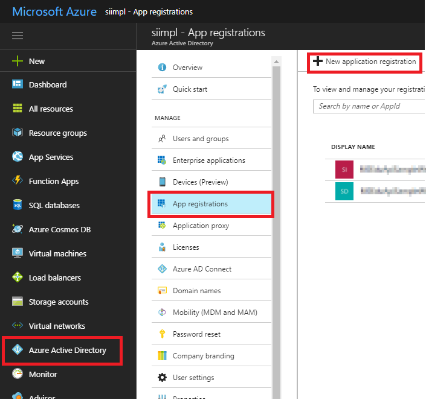
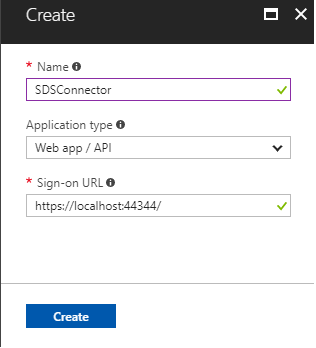
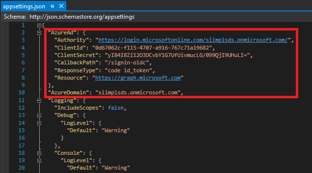
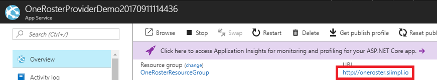
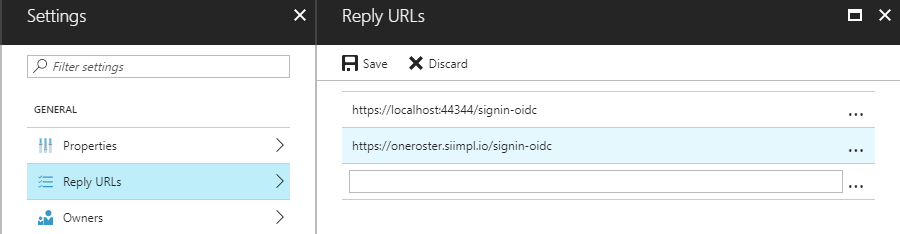

# OneRoster REST Provider Sample

This project implements OneRoster v1.1 behaviors.

Specifically, it targets requirements for:

1. OneRoster v1.1 Rostering REST Provider
2. OneRoster v1.1 Gradebook REST Provider

**Table of contents**
* [Sample Goals](#sample-goals)
* [Prerequisites](#prerequisites)
* [Build and debug locally](#build-and-debug-locally)
* [Deploy the sample to Azure](#deploy-the-sample-to-azure)
* [Sync with SDS](#sync-with-sds)
* [Understand the code](#understand-the-code)
* [Supported OneRoster Endpoints](#supported-oneroster-endpoints)
* [Unsupported Features](#unsupported-features)
* [Questions and comments](#questions-and-comments)
* [Contributing](#contributing)

## Sample Goals

The sample demonstrates:

* Data models supporting [OneRoster entities](https://www.imsglobal.org/oneroster-v11-final-specification#_Toc480452006)
* Action controllers supporting [OneRoster service endpoints](https://www.imsglobal.org/oneroster-v11-final-specification#_Toc480451989)
* Authorization middleware supporting [OneRoster Core Security](https://www.imsglobal.org/oneroster-v11-final-specification#_Toc480452001)
* Generation of [OneRoster CSV bundles](https://www.imsglobal.org/oneroster-v11-final-csv-tables)
* Consumption of [SDS Profile Management APIs](https://github.com/OfficeDev/O365-EDU-Tools/tree/master/SDSProfileManagementDocs) to create and start SDS sync profiles

OneRosterProviderDemo is based on ASP.NET Core Web.

## Prerequisites

**Deploying and running this sample requires**:

* An Azure subscription with permissions to register a new application, and deploy the web app.
* An O365 Education tenant with Microsoft School Data Sync enabled
* One of the following browsers: Edge, Internet Explorer 9, Safari 5.0.6, Firefox 5, Chrome 13, or a later version of one of these browsers.
* A tool to generate OAuth1 signatures, such as [Postman](https://www.getpostman.com/)
* Visual Studio 2017 (any edition), [Visual Studio 2017 Community](https://www.visualstudio.com/thank-you-downloading-visual-studio/?sku=Community) is available for free.
* Familiarity with C#, .NET Web applications and web services.

## Register the application in Azure Active Directory

1. Sign into the new azure portal: [https://portal.azure.com/](https://portal.azure.com/).

2. Click **Azure Active Directory** -> **App registrations** -> **+Add**.

   

3. Input a **Name**, and select **Web app / API** as **Application Type**.

   Input **Sign-on URL**: https://localhost:44344/

   

   Click **Create**.

4. Once completed, the app will show in the list.

   

5. Click it to view its details.

   

6. Click **All settings**, if the setting window did not show.

   * Click **Properties**, then set **Multi-tenanted** to **Yes**.

     Copy aside **Application ID**, then Click **Save**.

   * Click **Required permissions**. Add the following permissions:

     | API                            | Delegated Permissions                    |
     | ------------------------------ | ---------------------------------------- |
     | Microsoft Graph                | Read directory data Read and write directory data Access directory as the signed in user Read education app settings Manage education app settings |
     | Windows Azure Active Directory | Sign in and read user profile |

   * Click **Keys**, then add a new key:

     

     Click **Save**, then copy aside the **VALUE** of the key.

   Close the Settings window.

## Build and debug locally

This project can be opened with the edition of Visual Studio 2017 you already have, or download and install the Community edition to run, build and/or develop this application locally.

- [Visual Studio 2017 Community](https://www.visualstudio.com/thank-you-downloading-visual-studio/?sku=Community)

Debug **OneRosterProviderDemo**:

1. Configure **appsettings.json**.

   

   - **AzureAd:Authority**: "https://login.microsoftonline.com/{your-ad-tenant}.onmicrosoft.com/"
   - **AzureAd:ClientId**: use the Client Id of the app registration you created earlier.
   - **AzureAd:ClientSecret**: use the Key value of the app registration you created earlier.
   - **AzureDomain**: use your AD tenant domain, which should agree with the **AzureAd:Authority** entry

2. In the Package Manager Console, run the command `EntityFrameworkCore\Update-Database` to generate the initial database. If this causes an error, try running the command `Import-Package Microsoft.EntityFrameworkCore`.
3. Set **OneRosterProviderDemo** as StartUp project, and press F5.
4. Visit `/seeds` to populate your database with sample entities. Make sure to access the endpoint using HTTPS.

## Deploy the sample to Azure

1. Create a Publish Profile

  - Select **Build > Publish OneRosterProviderDemo**
  - Click **Create new profile**
  - Select **Microsoft Azure App Service** and **Create New**
  - Click **Publish**
  - Sign into your Azure account
  - Select a Resource Group for the deploy, or create a new one by clicking **New**
  - Select an App Service Plan for the deploy, or create a new one by clicking **New**
  - Click **Create**

2. Select **Build > Publish OneRosterProviderDemo**
3. Click **Publish**

**Add REPLY URL to the app registration**

1. After the deployment, open the resource group in Azure Portal
2. Click the web app.

   

   Copy the URL aside and change the schema to **https**, and add **/signin-oidc** to the end. This is the reply URL and will be used in next step.

3. Navigate to the app registration in the new azure portal, then open the setting windows.

   Add the reply URL:

   

   > Note: to debug the sample locally, make sure that https://localhost:44344/signin-oidc is in the reply URLs.

4. Click **SAVE**.

## Sync with SDS

There are two synchronization options, via the OneRoster REST endpoints, and by uploading [SDS compliant CSV files](https://support.office.com/en-us/article/CSV-files-for-School-Data-Sync-9f3c3c2b-7364-4f6e-a959-e8538feead70).

### Sync with OneRoster REST
1. Visit your deploy at /sds
2. Sign in with an admin account on your education tenant.
3. Verify that the "OneRoster endpoint" value agrees with your deployed instance
  - Note that this will not work unless your URL is publicly accessible
4. Click the "Sync via OneRoster REST" button

### Sync with SDS CSV
1. Visit your deploy at /sds
2. Sign in with an admin account on your education tenant.
3. Select your SDS CSV files
4. Click the "Sync via SDS CSV" button

## Understand the code

### Introduction

This web application is based on an ASP.NET Core Web project template.

### Authorization

#### OneRoster Endpoints
The `Middlewares/OAuth.cs` file defines a middleware that validates the OAuth1 or OAuth2 signature for each incoming request with a OneRoster route.  This file also contains the hard-coded client ID and secret.
In order to make OAuth2 requests, first visit the /token endpoint using OAuth1 credentials to get the access token.
The `Startup.cs` file configures the app to use this middleware.

#### SDS Profile Management
The `Startup.cs` file configures the app to use .NET Core's OpenIDConnect (oidc) library.  This flow is handled by `AccountController`.

### Data Models

Most of the OneRoster models have a corresponding model class in the `Models` directory.  Due to language naming conventions, some of these have been renamed.  The mapping of models is shown in the table below.

| OneRoster Model        | EFCore Model      |
|------------------------|-------------------|
| Base                   | BaseModel         |
| Academic Session       | AcademicSession   |
| Class                  | IMSClass          |
| Course                 | Course            |
| Demographic Data       | Demographic       |
| Enrollment             | Enrollment        |
| Line Item              | LineItem          |
| Line Item Category     | LineItemCategory  |
| Org                    | Org               |
| Resource               | Resource          |
| Result                 | Result            |
| User, Student, Teacher | User              |

Additional models were created to support various needs:

| EFCore Model            | Purpose                                         |
|-------------------------|-------------------------------------------------|
| IMSClassAcademicSession | Join table for Class, Term (Academic Session)   |
| UserAgent               | Join table for User, User                       |
| UserOrg                 | Join table for User, Org                        |
| UserId                  | Shape of user ids                               |
| SeedData                | Holds seed data for initial database population |
| OauthNonce              | Stores nonce values to disallow reuse           |

### Validation

Validation requirements are defined in the [OneRoster model specification](https://www.imsglobal.org/oneroster-v11-final-specification#_Toc480452006).

In addition to the validation attributes supplied by .NET and ASP Core, there are four custom validators for properties with specific requirements in the `Validators` folder.

#### Vocabulary
[Vocabularies](https://www.imsglobal.org/oneroster-v11-final-specification#_Toc480452048) used by OneRoster, including [enumerations](https://www.imsglobal.org/oneroster-v11-final-specification#_Toc480452020), are provided by the `Vocabulary/Vocabulary` class.

The subject code vocabulary "SCEDv4.0" is published by [NCES](https://nces.ed.gov/forum/SCED.asp); a conversion of the published spreadsheet is present in the `Vocabulary/sced-v4.csv` file, which is parsed at startup time.

### Customized Serialization

All response json objects are written using the NewtonSoft JSON nuget package, for the purposes of matching the [prescribed json bindings](https://www.imsglobal.org/oneroster-v11-final-specification#_Toc480452033).

All entities that can be serialized into a service endpoint response support two serialization methods, `AsJson` and `AsJsonReference`.

**AsJson** is used when the entity is the primary entity, or a member of the primary collection, that was requested.

**AsJsonReference** is used to express the entity as a [GUIDRef](https://www.imsglobal.org/oneroster-v11-final-specification#_Toc480452031).

### Pagination, Filtering, and Sorting

The `Controllers/BaseController` class hooks in [paging, filtering, and sorting](https://www.imsglobal.org/oneroster-v11-final-specification#_Toc480451994).

Filtering and sorting are implemented in the model classes via reflection in order to support the requirement that any data field be usable for filtering or sorting.

### Data Source

An SQLite database is assumed and configured in `Startup.cs`.

You can create a new, empty database by running the `EntityFrameworkCore\Update-Database` command in the Package Manager console, and seed it with sample data by visiting the `/seeds` endpoint.

## Supported OneRoster Endpoints

There are three OneRoster v1.1 service subsets, defined [here](https://www.imsglobal.org/oneroster-v11-final-specification#_Toc480451989).  Of these, the Rostering (read-only) and Gradebook (read-and-write) subsets are implemented by this sample.

### Rostering Endpoints (Read)

| Service Call                   | Endpoint                                            | HTTP Verb |
|--------------------------------|-----------------------------------------------------|-----------|
| getAllAcademicSessions         | /academicSessions                                   | GET       |
| getAcademicSession             | /academicSessions/{id}                              | GET       |
| getAllClasses                  | /classes                                            | GET       |
| getClass                       | /classes/{id}                                       | GET       |
| getStudentsForClass            | /classes/{class_id}/students                        | GET       |
| getTeachersForClass            | /classes/{class_id}/teachers                        | GET       |
| getAllCourses                  | /courses                                            | GET       |
| getCourse                      | /courses/{id}                                       | GET       |
| getClassesForCourse            | /courses/{course_id}/classes                        | GET       |
| getAllDemographics             | /demographics                                       | GET       |
| getDemographics                | /demographics/{id}                                  | GET       |
| getAllEnrollments              | /enrollments                                        | GET       |
| getEnrollment                  | /enrollments/{id}                                   | GET       |
| getAllGradingPeriods           | /gradingPeriods                                     | GET       |
| getGradingPeriod               | /gradingPeriods/{id}                                | GET       |
| getAllOrgs                     | /orgs                                               | GET       |
| getOrg                         | /orgs/{id}                                          | GET       |
| getAllSchools                  | /schools                                            | GET       |
| getSchool                      | /schools/{id}                                       | GET       |
| getCoursesForSchool            | /schools/{id}/courses                               | GET       |
| getClassesForSchool            | /schools/{school_id}/classes                        | GET       |
| getEnrollmentsForSchool        | /schools/{school_id}/enrollments                    | GET       |
| getEnrollmentsForClassInSchool | /schools/{school_id}/classes/class_id}/enrollments  | GET       |
| getStudentsForClassInSchool    | /schools/{school_id}/classes/{class_id}/students    | GET       |
| getStudentsForSchool           | /schools/{school_id}/students                       | GET       |
| getTeachersForClassInSchool    | /schools/{school_id}/classes/{class_id}/teachers    | GET       |
| getTeachersForSchool           | /schools/{school_id}/teachers                       | GET       |
| getTermsForSchool              | /schools/{school_id}/terms                          | GET       |
| getAllStudents                 | /students                                           | GET       |
| getStudent                     | /students/{id}                                      | GET       |
| getClassesForStudent           | /students/{id}/classes                              | GET       |
| getAllTeachers                 | /teachers                                           | GET       |
| getTeacher                     | /teachers/{id}                                      | GET       |
| getClassesForTeacher           | /teachers/{id}/classes                              | GET       |
| getAllTerms                    | /terms                                              | GET       |
| getTerm                        | /terms/{id}                                         | GET       |
| getClassesForTerm              | /terms/{id}/classes                                 | GET       |
| getGradingPeriodsForTerm       | /terms/{id}/gradingPeriods                          | GET       |
| getAllUsers                    | /users                                              | GET       |
| getUser                        | /users/{id}                                         | GET       |
| getClassesForUser              | /users/{id}/classes                                 | GET       |

### Gradebook Endpoints (Read)

| Service Call                  | Endpoint                                          | HTTP Verb |
|-------------------------------|---------------------------------------------------|-----------|
| getAllCategories              | /categories                                       | GET       |
| getCategory                   | /categories/{id}                                  | GET       |
| getAllLineItems               | /lineItems                                        | GET       |
| getLineItem                   | /lineItems/{id}                                   | GET       |
| getAllResults                 | /results                                          | GET       |
| getResult                     | /results/{id}                                     | GET       |
| getResultsForClass            | /classes/{class_id}/results                       | GET       |
| getLineItemsForClass          | /classes/{class_id}/lineItems                     | GET       |
| getResultsForLineItemForClass | /classes/{class_id}/lineItems/{li_id}/results     | GET       |
| getResultsForStudentForClass  | /classes/{class_id}/students/{student_id}/results | GET       |

### Gradebook Endpoints (Write)

| Service Call                  | Endpoint                                          | HTTP Verb |
|-------------------------------|---------------------------------------------------|-----------|
| deleteCategory                | /categories/{id}                                  | DELETE    |
| putCategory                   | /categories/{id}                                  | PUT       |
| deleteLineItem                | /lineItems/{id}                                   | DELETE    |
| putLineItem                   | /lineItems/{id}                                   | PUT       |
| deleteResult                  | /results/{id}                                     | DELETE    |
| putResult                     | /results/{id}                                     | PUT       |

## Unsupported Features

Currently, the following behaviors are not up to spec:

* [Nested property filtering](https://www.imsglobal.org/oneroster-v11-final-specification#_Toc480451997)
* [Field Selection](https://www.imsglobal.org/oneroster-v11-final-specification#_Toc480451998)

## Questions and comments

* If you have any trouble running this sample, please [log an issue](https://github.com/OfficeDev/O365-EDU-SDS-AspNetMVC-Samples/issues).
* Questions about ASP Core development in general should be posted to [Stack Overflow](https://stackoverflow.com/questions/tagged/asp.net-core). Make sure that your questions or comments are tagged with [asp.net-core].
* Questions about OneRoster development in general should be posted to [IMS Global](https://www.imsglobal.org/forums/ims-glc-public-forums-and-resources/oneroster-public-forum).

# Contributing

This project welcomes contributions and suggestions.  Most contributions require you to agree to a
Contributor License Agreement (CLA) declaring that you have the right to, and actually do, grant us
the rights to use your contribution. For details, visit https://cla.microsoft.com.

When you submit a pull request, a CLA-bot will automatically determine whether you need to provide
a CLA and decorate the PR appropriately (e.g., label, comment). Simply follow the instructions
provided by the bot. You will only need to do this once across all repos using our CLA.

This project has adopted the [Microsoft Open Source Code of Conduct](https://opensource.microsoft.com/codeofconduct/).
For more information see the [Code of Conduct FAQ](https://opensource.microsoft.com/codeofconduct/faq/) or
contact [opencode@microsoft.com](mailto:opencode@microsoft.com) with any additional questions or comments.

**Copyright (c) 2018 Microsoft. All rights reserved.**
